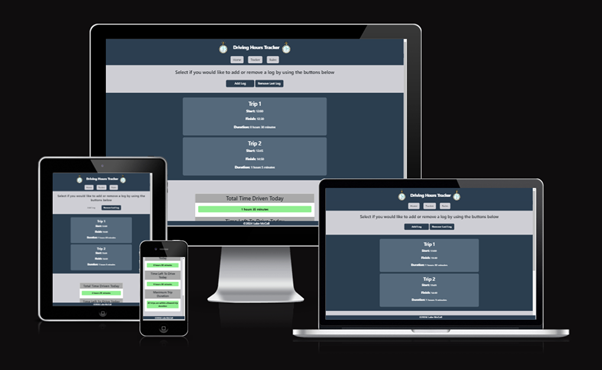
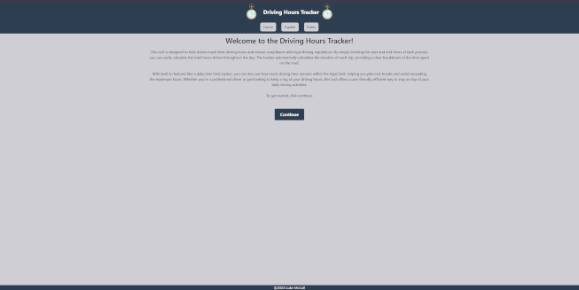
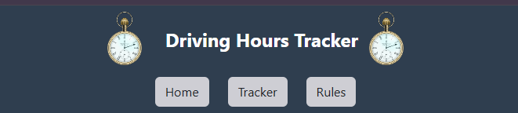
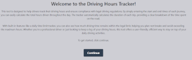
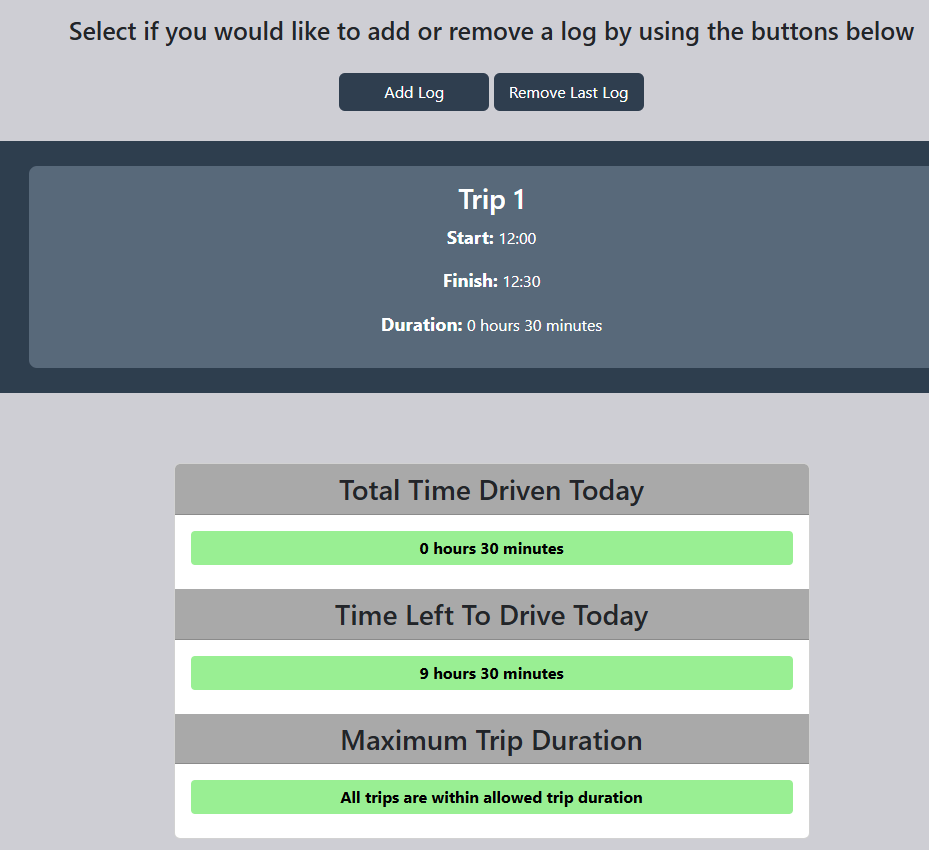
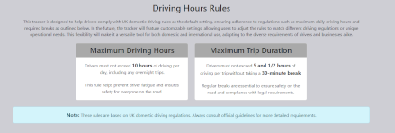

---

# *Driving Hours Tracker*

The site can be accessed by clicking on [this Link.](https://therealmccall.github.io/Driving-Hours-Tracker/)

---
## Contents

* [Project Overview](#project-overview)
* [User Stories](#user-stories)
* [Features](#features)
* [Future Development](#future-development)
* [Technologies Used](#technologies-used)
* [Design](#design)
* [Wireframes](#wireframes)
* [Deployment](#deployment)
* [Testing](#testing)
* [Credits](#credits)
* [Acknowledgements](#credits)
---

## Project Overview
The Driving Hours Calculator website is designed to help both individual drivers and transport companies efficiently track and manage their driving hours in accordance with legal regulations. As drivers face increasing pressure to meet both productivity goals and compliance standards, this tool simplifies the complex task of calculating and tracking driving hours to ensure that drivers adhere to required rest periods and avoid violations.

The website offers an easy-to-use interface that allows users to input driving start and end times, automatically calculating their trip duration, total driving hours, and hours remaining for the day. In addition to this core functionality, the site generates trip logs and a summary information panel that provide a clear view, helping them meet regulatory requirements.

By streamlining the process of tracking driving hours, the website aims to reduce errors, improve time management, and ensure compliance with transport industry regulations. This tool benefits both individual drivers seeking a simple way to log their hours and companies managing multiple drivers, ensuring they stay compliant while optimizing productivity.

## User Stories

### First Time Visitor Goals:

* Understand Site Purpose: As a first-time visitor, I want a clear explanation of the site’s purpose.
* Easy Navigation: As a first-time visitor, I want simple access to the driving hours tracker with a user-friendly interface.
* Learn Basic Legal Requirements: As a first-time visitor, I want a quick overview of essential driving hours regulations.

### Returning Visitor Goals:

* Quick Access to Tracker Features: As a returning user, I want to be able to easily locate the tracker and use key features, such as adding and removing logs.
* Clear View of Logs: As a returning user, I want to be able to clearly view the driving logs I have inputted.
* Detailed Summary: As a returning user, I want to be able to clearly see when I have exceeded any driving hours.

### Frequent Visitor Goals:
* Track Progress towards Goals: As a frequent user, I want a clear display of my total driving hours and the remaining driving time left.

## Features

+ ### Home Page

    - Represents:

        * The name of the application.
        * Information about the tracker and what the user can expect.
        * Github link at the bottom of the page.
        * The page is responsive on common screen sizes.

#### Header and Navigation buttons

- Includes:

    * The name of the web application.
    * Has logos that represent the site being a time tracking tool.
    * Clickable header that brings you back to the home page.
    * Contains navigation buttons that takes you to the home, tracker or rules page.
    * The navigation buttons change colour when you hover over them.

#### Introduction Section

- Includes:
        
    * An introduction to the tracker explaining what to expect.
    * Explanation of features for the tracker.
    * Continue button that changes colour when hovered over.
    * Continue button when clicked moves to the tracker section of the site.

#### Footer Section

- Includes:

    * Copyright name which links to github site and changes colour when hovered over.

--- 
+ ### Tracker Page

    - Includes:
       
        * A fully responsive page on all screen sizes.
        * An option to add log which brings up a modal to enter start and finish time.
        * an option to remove last log.
        * An information panel with time driven today section.
        * An information panel with time left to drive section.
        * an information panel which whether trip durations are within the rule set.
        * all panels change colour from green to red to indicate compliance.

---
+ ### Rules Page

    - Includes:
        
        * An identical Header Section as the main page for consistency.
        * An identical Footer Section as the main page for consistency.
        * A paragraph with a simplified explanation of driving hours rules.
        * A card explaining maximum driving hours.
        * A card explaining maximum trip duration.
        * A small print section explaining that drivers should also do their own research on regulations.

---

## Future Development

- In the futures I would like to implement the following extra features:

    * Database storage to allow for additional features including multiple days tracking.
    * Ability to login to save data to an individual.
    * Automatically detect if a driver is logging an overnight trip.
    * Calculate break taken between trip logs.
    * If a driver drives for more than 5 and a half hours without a 30 minutes break then logs duration to be added together.
    * Fix unsolved bug where a user can start their next trip within the trip before.

## Technologies Used

- Technologies used to create the site include:
    * [HTML](https://developer.mozilla.org/en-US/docs/Web/HTML) - was used to create the website.
    * [CSS](https://developer.mozilla.org/en-US/docs/Web/css) - was used for the styling of the website.
    * [JavaScript](https://www.w3schools.com/js/) - was used to add interactivity to the tracker.
    * [Bootstrap](https://getbootstrap.com/) - Framework used.
    * [Gitpod](https://gitpod.io/) - was the cloud based IDE used for creating and editing of the code.
    * [VSCode](https://code.visualstudio.com/) - IDE Used.
    * [Git](https://www.git-scm.com/) - was used for website version control.
    * [GitHub](https://github.com/) - was used for hosting of the code of the website.
    * [GitHub Pages](https://pages.github.com/) - was used for hosting the deployed front-end site.

## Design

### Color Scheme

- Dark-blue-grey was used for the navigation bar background as it has a modern and professional tone, it provides a sense of stability and structure to the interface.  It also contrasts well with lighter elements, ensuring easy navigation while maintaining a clear aesthetic.

- A light grey was used as the main background colour to create a neutral canvas that allows content to be more prominent while mainintaining a modern feel.

- A dark grey background was used for the card headers to add depth and contract to the design.  This also gives the card headers a distintive look, helping users intuitively focus on key sections of the display.

- A white background was reserved for displaying critical information to maximize readability and clarity. This color dynamically changes to green or red to provide immediate visual feedback to the user. Green reassures the user that their activities are within safe limits, while red alerts them when they are not.

### Typography

- The **bold, large, font** for the header conveys clarity and modernity. It grabs attention, reflects the utility-based purpose of the application, and ensures readability at a glance.
- The main body text is kept **simple and clean** and ensures readability, particularly on digital screens, making it user-friendly for all audiences.
- Button typography is **clear and consistent**, focusing on functionality over decoration.
- The buttons large size and contrast make them easy to spot and interact with, enhancing accessibility.
- The modal headers and labels use **structured, centered typography** that directs focus on user input fields. This aligns with the goal of facilitating quick and accurate data entry.

--

- The typography for cards and trip logs is **hierarchical**:
  - **Bold headings** (e.g., "Total Time Driven Today") immediately communicate key information categories.
  - Smaller, clear fonts for the details (e.g., "10 hours 0 minutes") ensure the most important data is easily digestible.
  - Typography within the cards are styled with color cues to differentiate between acceptable and non-acceptable driving durations.
  - The use of bold and contrasting colors (light green for acceptable, red for warnings) enhances user comprehension.

### Wireframes

#### Mobile devices

- [Home Page. Mobile Screen](documentation/wireframes/home-page-mobile.png)
- [Tracker Page. Mobile Screen](documentation/wireframes/tracker-mobile.png)
- [Rules Page. Mobile Screen](documentation/wireframes/rules-mobile.png)

#### Tablets

- [Home Page. Tablet Screen](documentation/wireframes/home-page-tablet.png)
- [Tracker Page. Tablet Screen](documentation/wireframes/tracker-tablet.png)
- [Rules Page. Tablet Screen](documentation/wireframes/rules-tablet.png)

#### Desktop

- [Home Page. Desktop Screen](documentation/wireframes/home-page-desktop.png)
- [Tracker Page. Desktop Screen](documentation/wireframes/tracker-desktop.png)
- [Rules Page.. Desktop Screen](documentation/wireframes/rules-desktop.png)

---

## Deployment

### Deployment to Github Pages

- The site was deployed to GitHub pages. The steps to deploy are as follows: 
  - In the [GitHub repository](https://github.com/TheRealMcCall/Driving-Hours-Tracker), navigate to the Settings tab 
  - From the source section drop-down menu, select the **Main** Branch then click "Save".
  - Once the branch has been selected, the page will be automatically refreshed with a detailed ribbon display to indicate the successful deployment.

The live link can be found [here](https://therealmccall.github.io/Driving-Hours-Tracker/)

### Local Deployment

In order to make a local copy of this project, you can clone it.
In your IDE Terminal, type the following command to clone my repository:

- `git clone https://github.com/TheRealMcCall/Driving-Hours-Tracker.git`

---

## Testing

Please refer to [TESTING.md](TESTING.md) file for all documentation related to testing.

## Credits

### Content

- [Bootstrap 5 Modal](https://getbootstrap.com/docs/5.0/components/modal/) - for instructions on how to build a modal (which I used as the method for creating logs)

### Media

- Pocket watch image was sourced from [Pixabay](https://www.Pixabay.cp) and can be found [here](https://pixabay.com/vectors/clock-time-watch-pocket-watch-158617/).

### Tools
- Screenshot Images for the README file were scaled down with [GIMP](https://www.gimp.org/).
- [Ui.dev](https://ui.dev/amiresponsive) - Website used for creating a preview of my website on different screen sizes.

## Acknowledgements
- [Iuliia Konovalova](https://github.com/IuliiaKonovalova) - My Code Insitute Mentor for all her help, support and advice.
- [Lewis Dillon](https://github.com/LewisMDillon) - Code Insitute Cohort Facilitator weekly stand-ups and motivational support.
- [Dom Francis](https://github.com/dvfrancis) - Fellow Code Insitute Student for his continuous motivational support.
- Michael Linley - Good friend of mine, for all his support and encouragement.

---

* [Back To Top](#contents)