# Testing
---
# Contents

* [Browser Compatibility](#browser-compatibility)
* [Responsiveness](#responsiveness)
* [Manual Testing](#manual-testing)
* [Validator Testing](#validator-testing)
* [LightHouse Report](#lighthouse-report)
* [Bugs](#bugs)
* [Unsolved Bugs](#unsolved-bugs)
---

## Browser Compatibility

I've tested my deployed project on multiple browsers to check for compatibility issues.

| Browser | Screenshot | Notes |
| --- | --- | --- |
| Chrome | 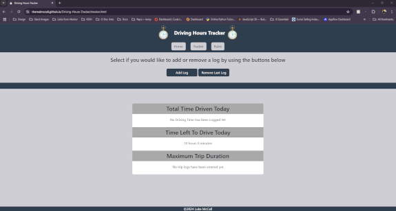 | Works as expected |
| Firefox | 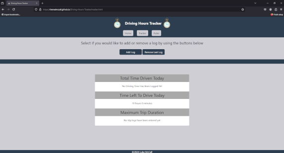 | works as expected |
| Edge | 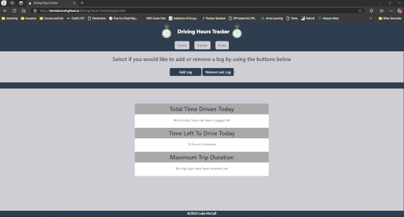 | Works as expected |

## Responsiveness

The website was tested on the following browsers for responsiness with no problems found.
  - Chrome
  - Firefox
  - Edge

The website was also tested on numerous sized screens and responded to all sizes:-
  - Google Pixel 8 Pro 
  - Samsung Galaxy S22 PLUS 
  - iPhone 15
  - 15" 1080p laptop screen 
  - 24" 1080p desktop screen 
  - 27" 1440p desktop screen

The website was checked on various personal devices and [responsiveviewer.org](https://responsiveviewer.org/) was used to check others.

| Device | Screenshot | Notes |
| --- | --- | --- |
| 1440p Desktop Monitor | 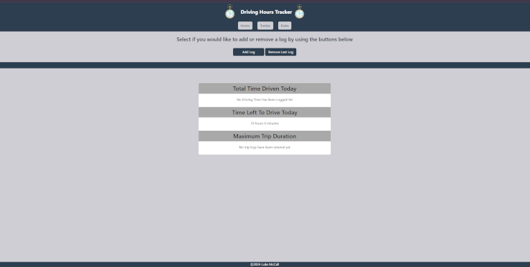 | Works as expected |
| 1080p Desktop Monitor | 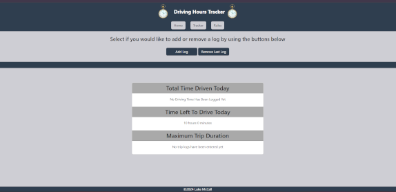 | Works as expected |
| 1080p Portrait Desktop Monitor | 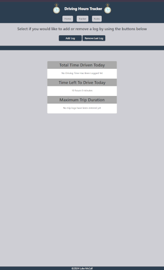 | Works as expected |
| Google Pixel 8 Pro | 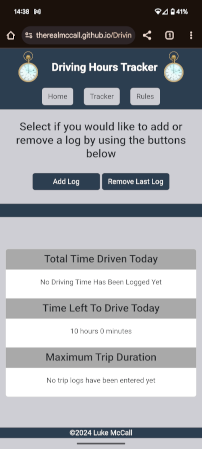 | Works as expected |

Please note some of the screenshots above have been re-scaled to be easily viewed.

Chrome development tools were also used throughout the design process to check responsiveness and breakpoints. Adjustments were made accordingly.

## Manual Testing

Manual testing was carried out on all pages to ensure consistency.

## Validator Testing
+ ### HTML
  #### Home Page
    - No errors or warnings were found when passing through the official W3C validator.

    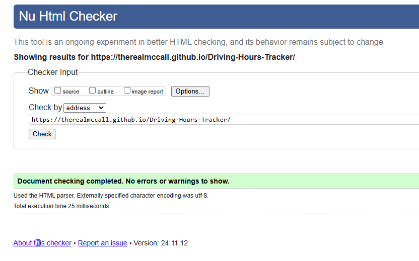
    
  #### Tracker Page
    - No errors or warnings were found when passing through the official W3C validator.

    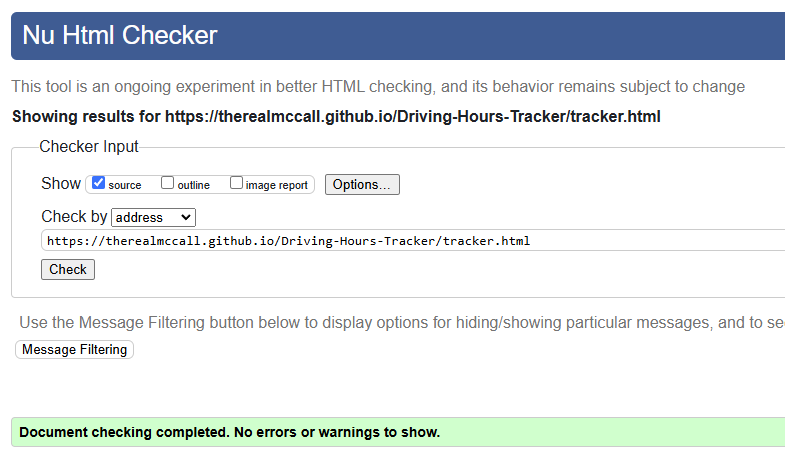

  #### Rules Page
    - No errors or warnings were found when passing through the official W3C validator.

    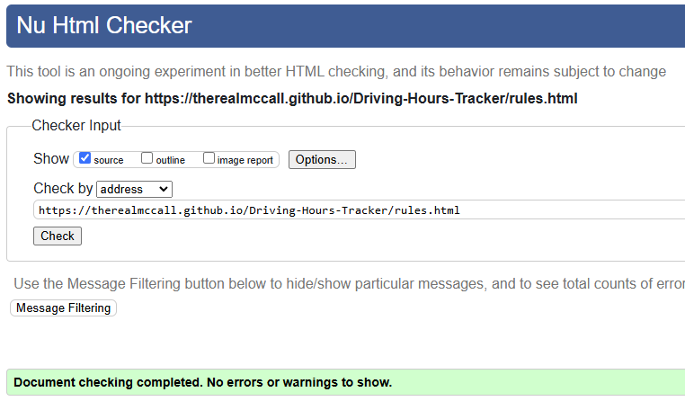

+ ### CSS
  No errors or warnings were found when passing through the official W3C (Jigsaw) validator.

  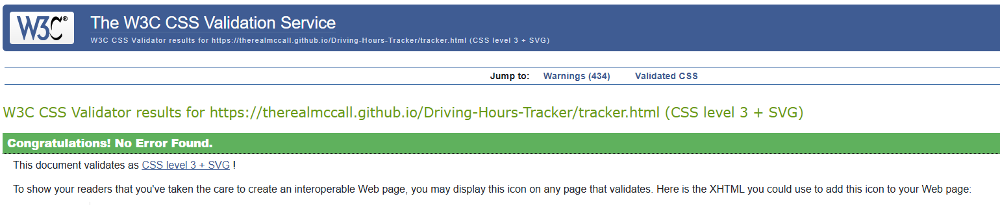
 
---

+ ## LightHouse report
 - Using lighthouse in devtools I confirmed that the website is performing well, accessible and colors and fonts chosen are readable.
    
  ### Home page

  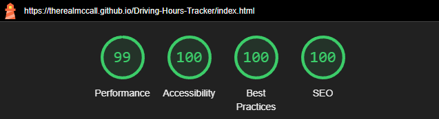

  ### Tracker page

  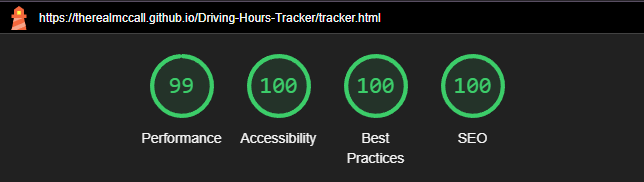

  ### Rules page

  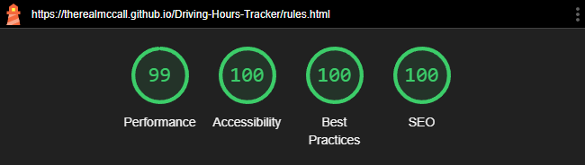

---
## Bugs
+ ### Solved Bugs

+ ### Unsolved bugs.

---

* [Back To Top](#Testing)