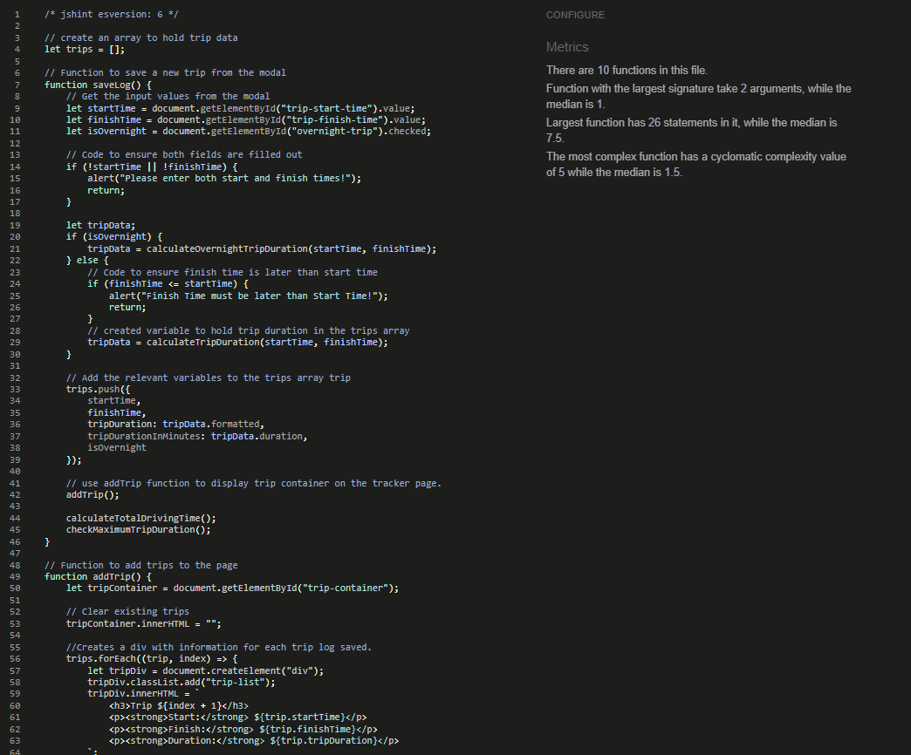
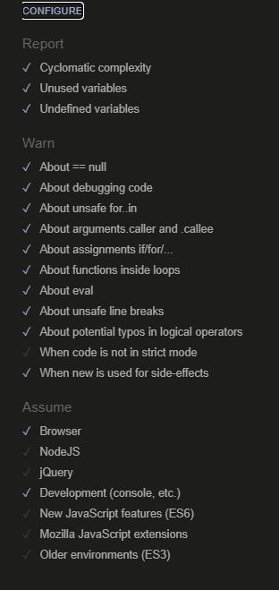
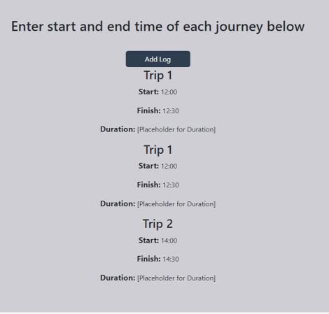
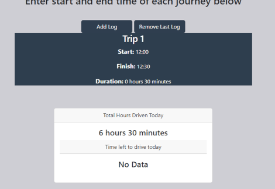
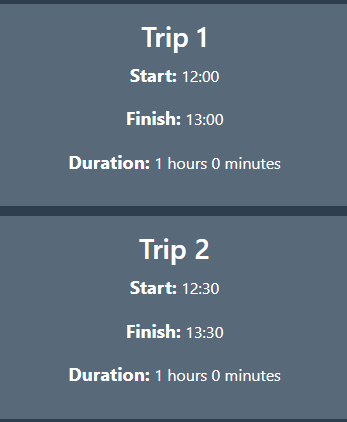

# Testing
---
# Contents

* [Browser Compatibility](#browser-compatibility)
* [Responsiveness](#responsiveness)
* [Manual Testing](#manual-testing)
* [Validator Testing](#validator-testing)
* [LightHouse Report](#lighthouse-report)
* [Bugs](#bugs)
* [Unsolved Bugs](#unsolved-bugs)
---

## Browser Compatibility

I've tested my deployed project on multiple browsers to check for compatibility issues.

| Browser | Screenshot | Notes |
| --- | --- | --- |
| Chrome |  | Works as expected |
| Firefox |  | works as expected |
| Edge |  | Works as expected |

## Responsiveness

The website was tested on the following browsers for responsiness with no problems found.
  - Chrome
  - Firefox
  - Edge

The website was also tested on numerous sized screens and responded to all sizes:-
  - Google Pixel 8 Pro 
  - Samsung Galaxy S22 PLUS 
  - iPhone 15
  - 15" 1080p laptop screen 
  - 24" 1080p desktop screen 
  - 27" 1440p desktop screen

The website was checked on various personal devices and [responsiveviewer.org](https://responsiveviewer.org/) was used to check others.

| Device | Screenshot | Notes |
| --- | --- | --- |
| 1440p Desktop Monitor |  | Works as expected |
| 1080p Desktop Monitor |  | Works as expected |
| 1080p Portrait Desktop Monitor |  | Works as expected |
| Google Pixel 8 Pro |  | Works as expected |

Please note some of the screenshots above have been re-scaled to be easily viewed.

Chrome development tools were also used throughout the design process to check responsiveness and breakpoints. Adjustments were made accordingly.

## Manual Testing

Manual testing was carried out on all pages to ensure consistency.

### Tests that were carried out on all pages:

| Feature | Action | Expected Result | Working as intended |
| --- | --- | --- | --- |
|HEADER|
|Driving Hours Tracker Text	  | Click  | Links to Home Page | Yes, clicks results in the user being redirected to the home page. |
|Home Button  | Hover over home button  | Background and font colour changes | Yes, background darkens and font changes white as intended. |
|Tracker Button  | Hover over tracker button  | Background and font colour changes | Yes, background darkens and font changes white as intended. |
|Rules Button  | Hover over rules button | Background and font colour changes | Yes, background darkens and font changes white as intended. |
|Home Button  | Click on Home  | Links to Home Page| Yes, User is redirected to the home page |
|Tracker Button  | Click on tracker button  | Links to tracker page | Yes, User is redirected to the tracker page |
|Rules Button  | Click on rules button  | Links to rules page | Yes, User is redirected to the rules page |
|  |  | |
| FOOTER  | | |
| Copyright Section	| Hover over author |text turns black | Yes, the fonts changes colour as anticipated |
|  |  | |

### Home Page:
| Feature | Action | Expected Result | Working as intended |
| --- | --- | --- | --- |
| Page Content | Displaying content	|Introduction text is displayed | Yes, paragraph explaining the site is showing properly.|
| Page Content | Responsive page	|Page is responsive at all screen sizes | Yes, tested alongside development with chrome dev tools |

### Tracker Page:

| Feature | Action | Expected Result | Working as intended |
| --- | --- | --- | --- |
| Add Log Button | Hover over add log button	|Background of button changes colour | Yes, background of button lightens as intended |
| Remove Log Button | Hover over remove log button	|Background changes colour | Yes, background of button lightens as intended |
| Add Log Button | Click on add log button	|Pops up add log Modal | Yes, modal correctly displays when add log button is pressed |
| Remove Log Button | Click on remove log button when there are logs | removes the last log | Yes, button correctly removes last log from the page |
| Remove Log Button | Click on remove log button when there are no logs	| alerts user that no logs have been created | Yes, user is alerted |
| Total Time Driven Today | Information display | Displays total time driven today to user | Yes, total time driven updates when new logs are added |
| Time Left To Drive Today | Information display | Displays total time remaining to user | Yes, total time remaining updates when new logs are added |
| Maximum Trip Duration | Information display | Displays when a single trip log duration goes over 5 and a half hours | Yes, Maximum trip duration indicator works as intended |
| Total Time Driven Today | Information display | Updates total time driven today when there are multiple trip logs added | Yes, total time driven updates when additional logs are added |
| Time Left To Drive Today | Information display | Updates total time remaining to user when there are multiple trip logs added | Yes, total time remaining updates when additional logs are added |
| Total Time Driven Today | Information display | Updates total time driven today when trip logs are removed | Yes, total time driven updates when trip logs are removed |
| Time Left To Drive Today | Information display | Updates total time remaining to user when trip logs are removed | Yes, total time remaining updates when trip logs are removed |

### Modal Popup:

| Feature | Action | Expected Result | Working as intended |
| --- | --- | --- | --- |
| Modal Display| Information display	| Modal Display has explanation header and correct input fields | Yes, Modal is displaying as intended. |
| Modal input fields | entering data into input fields	| Only allows user to enter time format | Yes, input fields only allow the user to input a time |
| Modal input fields | entering data into input fields	| Does not allow user to pick a finish time that is before the start time | Yes, this function is working working as intended |
| Modal input fields | entering data into input fields	| Does not allow user to pick a finish time that is before the start time | Yes, this function is working working as intended |
| Cancel Button | Hover over cancel button	| Background of button changes colour | Yes, background of button darkens as intended |
| Save Changes Button | Hover over save changes Button	| Background changes colour | Yes, background of button darkens as intended |
| Cancel Button | Click on Cancel Button	| closes modal and does not make any changes | Yes, modal correctly closes without making any changes to the logs |
| Save Changes Button | Click on save changes button when any input fields data is missing | alerts user that both input fields must be filled in | Yes, button correctly alerts user and does not save a log |
| Save Changes Button | Click on save changes button when both input fields are complete | closes modal, and saves a log to the tracker | Yes, button correctly saves a trip log to the tracker |
| Save Changes button with Overnight Trip Checkbox | When checked save changes allows overnight trips | closes modal, and saves a log to the tracker, calculating overnight trip | Yes, button correctly saves an overnight trip log to the tracker |

### Rules Page:

| Feature | Action | Expected Result | Working as intended |
| --- | --- | --- | --- |
| Page Content | Displaying content	|Driver rules are displayed | Yes, driving rules and other page content displaying correctly |
| Page Content | Responsive page	|Page is responsive at all screen sizes | Yes, tested alongside development with chrome dev tools |

## Validator Testing
+ ### HTML
  #### Home Page
    - No errors or warnings were found when passing through the official W3C validator.

    
    
  #### Tracker Page
    - No errors or warnings were found when passing through the official W3C validator.

    

  #### Rules Page
    - No errors or warnings were found when passing through the official W3C validator.

    

+ ### CSS
  No errors or warnings were found when passing through the official W3C (Jigsaw) validator.

    

+ ### JS
    - No errors or warnings were found when passing through the official [JSHint](https://jshint.com/) validator.

    

    - These were the settings used with the JSHint validator.

    
---

+ ## LightHouse report
 - Using lighthouse in devtools I confirmed that the website is performing well, accessible and colors and fonts chosen are readable.
    
  ### Home page

  

  ### Tracker page

  

  ### Rules page

  

---
## Bugs
### Solved Bugs

- Problem: Trips duplicating instead of listing one by one

    
- Solution: added code to remove trips existing trips and start with a blank trip container using the following code:

        // Clear existing trips
        tripContainer.innerHTML = "";

- Problem: Total Hours driven does not update when you remove a trip

    
- Solution: Add CalculateTotalDrivingTime() function to removeLastLog function to solve bug with Total time driven not displaying properly

        // Recalculate total driving time
    calculateTotalDrivingTime();

### Unsolved bugs.

- Problem: Tracker allows the user to create a trip start-time within another trip time.

- Possible Solution: I am confident with some more time I would have solved this bug.

---

* [Back To Top](#Testing)